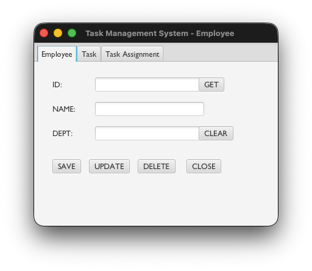
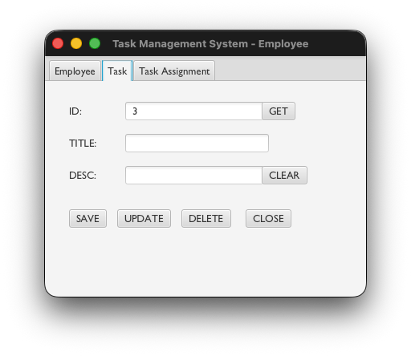
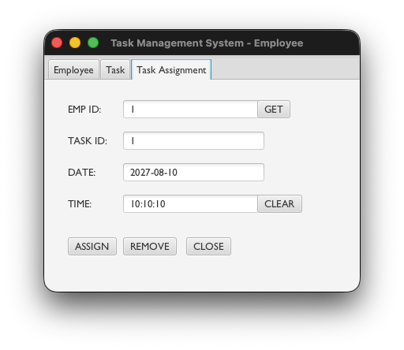

# SWE 212 - Distributed Information and Management Systems: Project 1

## Task Management System

This project was developed as part of the **SWE 212 - Distributed Information and Management Systems** course at Sakarya University, Department of Software Engineering.It is a desktop application featuring a 3-Tier Architecture, built using a JavaFX interface and PostgreSQL database.

**Instructor:** Ahmet Özmen
**Term:** Spring 2026
**Students:** Muhammed Uyan, Berkay Efe Öncü, Gürbüz Cem Çiven

---

## 📋 Project Overview
The Task Management System is a distributed information system designed to manage employees and tasks within a corporate structure. The application performs CRUD (Create, Read, Update, Delete) operations through a user-friendly interface.

### Key Features
* **Employee Management:** Adding, fetching, updating, and deleting employee records.
* **Task Management:** Creating tasks, managing descriptions, and updating statuses.
* **Database Integration:** Live connection via JDBC to a PostgreSQL database.
* **Modern Interface:** Responsive layouts designed using JavaFX and Scene Builder.


---

## 🛠 Technologies Used

* **Programming Language:** Java (JDK 21+) 
* **Interface (GUI):** JavaFX 21 (Modular SDK) 
* **Database:** PostgreSQL 16 
* **Build Tool:** Maven
* **IDE:** IntelliJ IDEA 

---

## 📷 Screenshots

### 2. Employee Management (Employee GUI)
The interface interacting with the `employees` table in the database.



### 3. Task Management (Task GUI)
The interface interacting with the `tasks` table in the database.



### 3. Task Assigment Dashboard
The interface for managing task assignments, interacting with the `Taskers` table in the database.



---

## ⚙️ Installation and Execution

Follow the steps below to run the project on your local machine:

### 1. Database Setup
Create a database named `task_db` on PostgreSQL and execute the following SQL commands:

```sql
CREATE DATABASE task_db;

-- Employees Table
CREATE TABLE employees (
    id SERIAL PRIMARY KEY,
    name VARCHAR(16) NOT NULL,
    department VARCHAR(16) NOT NULL
);

-- Tasks Table
CREATE TABLE tasks (
    id SERIAL PRIMARY KEY,
    name VARCHAR(16) NOT NULL,
    description VARCHAR(64)
);

-- CREATE TABLE Taskers (
    employee_id INTEGER REFERENCES Employees(id) ON DELETE CASCADE,
    task_id INTEGER REFERENCES Tasks(id) ON DELETE CASCADE,
    task_date DATE NOT NULL,
    task_time TIME NOT NULL,
    PRIMARY KEY (employee_id, task_id)
);